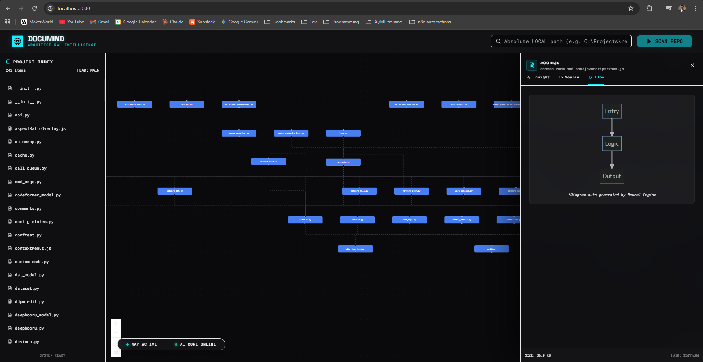

# 🧠 DocuMind: Architectural Intelligence & Visual Logic Mapping

> **Bridging the gap between code-level implementation and high-level architectural intent.**

DocuMind is an advanced engineering tool designed to transform complex, opaque codebases into interactive, navigable blueprints. By combining **AST-native static analysis** with **LLM-driven contextual reasoning**, it provides developers and architects with a living map of their system's "Forest" without losing sight of the "Trees."



---

## 🏗️ The Core Thesis: Solving Architectural Drift
In modern software engineering, documentation often becomes stale the moment it is committed. Architectural drift—the gap between the intended design and the actual implementation—is a primary source of technical debt. 

**DocuMind** addresses this by:
1.  **Automating Discovery**: No manual diagramming. The code is the source of truth.
2.  **Contextualizing Logic**: Moving beyond simple dependency strings to understand "Architectural Roles."
3.  **Visualizing Boundaries**: Grouping modules into hierarchical "Zonal Folders" to show project encapsulation.

---

## 🚀 Engineering Sophistication

### 1. Precision Static Analysis (AST-Native)
Unlike basic regex-based tools, DocuMind utilizes a full **TypeScript Abstract Syntax Tree (AST)** parser via `ts-morph`. 
- **Exact Resolution**: Detects ES Modules (`import`), CommonJS (`require`), and type-only dependencies.
- **Structural Inference**: Automatically identifies exports, entry points, and side-effect modules.

### 2. Contextual AI Summarization
DocuMind leverages **Gemini Pro** to read beyond the syntax. It analyzes the *intent* of each module to assign logical tags:
- **Orchestrators**: Modules that manage flow between other services.
- **Data Sinks**: Persistence and state-heavy modules.
- **Logic Engines**: Pure functional computation zones.
- **Edge Providers**: Entry points and API definitions.

### 3. Hyper-Performant Visualization
Built on **React Flow**, the graph engine is optimized for large-scale dependency trees. 
- **Zonal Mapping**: Directory hierarchies are rendered as nested zones, allowing for clear visualization of module boundaries.
- **Interactive Tracing**: Click any node to highlight its entire dependency chain, providing instant impact analysis.

---

## 💼 Strategic Value

### For Software Architects
- **Structural Integrity**: Identify circular dependencies and tight coupling at a glance.
- **Pattern Discovery**: Audit the codebase for consistency in architectural patterns.
- **Refactoring Planning**: Visually scope out the impact of a major structural change.

### For Senior Developers & Leads
- **Onboarding Acceleration**: Reduce a new hire's "Time-to-Code" from days to hours by providing an interactive mental model.
- **Quality Assurance**: Use the visual map to verify that logic is residing in the correct architectural layer.
- **Knowledge Persistence**: Ensure that the "Why" behind the code is preserved and easily accessible.

---

## 🛠️ Technical Implementation
- **Framework**: [Next.js 14](https://nextjs.org/) (App Router Architecture)
- **Graph Orchestration**: [React Flow](https://reactflow.dev/)
- **Analysis Engine**: [ts-morph](https://ts-morph.com/) (TypeScript AST discovery)
- **Intelligence Layer**: [Google Generative AI](https://github.com/google/generative-ai-js) (Gemini SDK)
- **Motion & UX**: Framer Motion + Tailwind CSS
- **Design Aesthetic**: "Industrial Utilitarian" — Focused on high-density information with a premium, technical feel.

---

## ⚙️ Advanced Engineering Workflows

### Intelligent Content Hashing
To minimize LLM latency and API costs, DocuMind employs **MD5-based content fingerprinting**. AI analysis is only re-triggered when the logical fingerprint of a file changes, ensuring sub-second re-scans for large projects.

### Heuristic Fallback Engine
Robustness is a core pillar. When API keys are unavailable, DocuMind transitions to a **Heuristic Logic Engine** that derives architectural roles from naming conventions and directory structures, ensuring a seamless fallback experience.

---

## 📡 Deployment & Local Setup

1. **Clone & Install**:
   ```bash
   git clone https://github.com/your-repo/documind.git
   cd documind
   npm install
   ```
2. **Configure AI (Recommended)**:
   - Rename `.env.local.example` to `.env.local`.
   - Add your `GEMINI_API_KEY` to enable deep architectural reasoning.
3. **Launch Engine**:
   ```bash
   npm run dev
   ```
4. **Scan Workspace**:
   - Input the **Absolute Path** of your target repository.
   - Click **SCAN REPO** to generate the blueprint.

---

## 🔭 The Vision: PR-Centric Architecture
The next evolution of DocuMind is the integration of **Architectural Diffs**. Imagine a CI/CD process where every Pull Request generates a visual map of what changed, allowing reviewers to see how a feature alters the system's structural integrity before it is merged.

---
*Developed with a focus on Developer Experience (DX) and Architectural Clarity.*